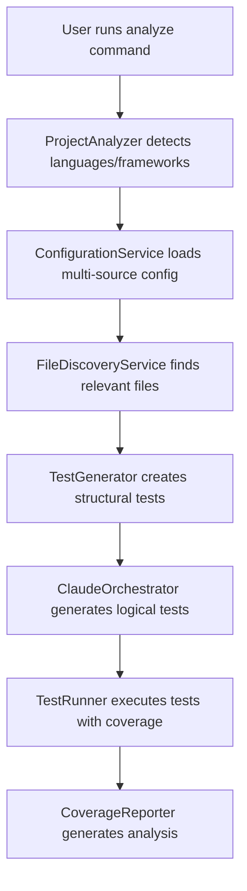
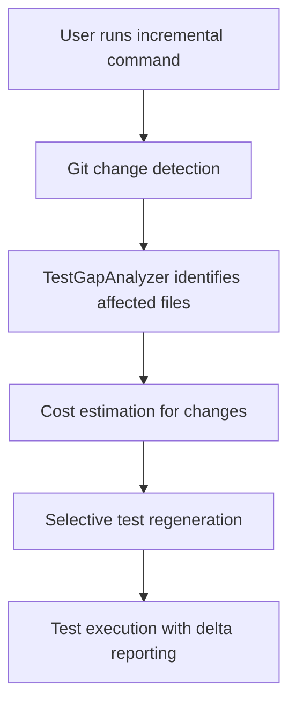
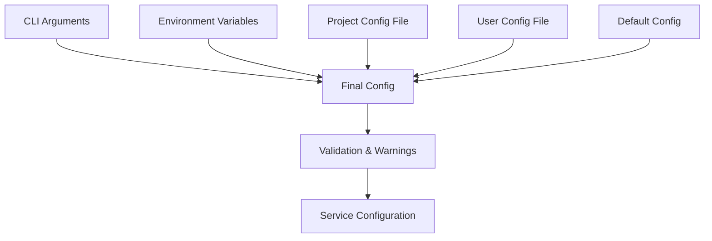

# Architecture Overview

*Last updated: 2025-07-06 | Process Context Isolation System Phase 2 completed - test generation sandboxing with ImportSanitizer implemented*

## 🏗️ System Architecture

### High-Level Architecture

The Claude Testing Infrastructure follows a **decoupled external testing approach** with a **Language Adapter Pattern** for multi-framework support:

```
┌─────────────────────────────────────────────────────────────────┐
│                          CLI Interface                         │
│  analyze • test • run • incremental • generate-logical-batch   │
└────────────────────────┬────────────────────────────────────────┘
                         │
┌────────────────────────▼────────────────────────────────────────┐
│                   Core Service Layer                           │
│  FileDiscoveryService • ConfigurationService • ProjectAnalyzer │
└────────────────────────┬────────────────────────────────────────┘
                         │
        ┌────────────────┴────────────────┐
        │                                 │
┌───────▼────────┐                ┌──────▼────────┐
│   JavaScript   │                │    Python     │
│    Adapter     │                │   Adapter     │
├────────────────┤                ├───────────────┤
│ • React/Vue    │                │ • FastAPI     │
│ • Node/Express │                │ • Flask       │
│ • Jest/Vitest  │                │ • pytest     │
│ • ESM/CommonJS │                │ • Django      │
└────────────────┘                └───────────────┘
        │                                 │
        └─────────────────┬───────────────┘
                          │
┌─────────────────────────▼─────────────────────────┐
│              AI Integration Layer                 │
│  ClaudeOrchestrator • BatchedLogicalTestGenerator │
│  TaskCheckpointManager • CostEstimator           │
└───────────────────────────────────────────────────┘
```

### Core Architectural Principles

#### 1. **Decoupled-Only Philosophy**
- **Zero Modification**: Never touches target project files
- **External Storage**: All tests stored in `.claude-testing/` directory
- **Infrastructure-as-Code**: Updates via `git pull` with continuous improvements
- **Clean Separation**: Target project remains pristine

#### 2. **Language Adapter Pattern**
- **Unified Interface**: Common interfaces (IProjectDetector, ITestConfigurator, ITemplateProvider)
- **Language-Specific Implementations**: Dedicated adapters for JavaScript/TypeScript and Python
- **Framework Detection**: Automatic identification of React, Vue, Express, Django, etc.
- **Extensible Design**: Easy addition of new language support

#### 3. **Service-Oriented Architecture**
- **Centralized Services**: FileDiscoveryService, ConfigurationService for consistency
- **Factory Patterns**: TestGeneratorFactory, TestRunnerFactory for clean instantiation
- **Dependency Injection**: Services injected into generators and runners
- **Singleton Management**: Consistent service instances across all commands

## 🔧 Core Components

### Service Layer Components

#### **FileDiscoveryService** (`src/services/FileDiscoveryService.ts`)
**Purpose**: Centralized file discovery with intelligent caching and pattern management

**Key Features**:
- **Smart Caching**: 70%+ cache hit rate with TTL-based invalidation
- **Pattern Management**: Language-specific patterns with user configuration merging
- **Cross-Platform**: Consistent behavior across Windows, macOS, Linux
- **Performance**: Optimized for large codebases with async/await patterns

**Integration Points**:
- Used by all 9 CLI commands for consistent file operations
- Integrated with ProjectAnalyzer for framework detection
- Shared across TestGenerator and TestRunner components

#### **ConfigurationService** (`src/config/ConfigurationService.ts`)
**Purpose**: Multi-source configuration management with precedence handling

**Configuration Sources** (highest to lowest priority):
1. CLI arguments
2. Environment variables
3. Project configuration file (`.claude-testing.config.json`)
4. User configuration file (`~/.claude-testing.config.json`)
5. Default configuration

**Key Features**:
- **Source Validation**: Individual validation with error/warning reporting per source
- **Template System**: 6 pre-built templates for common frameworks
- **Environment Mapping**: Automatic mapping of `CLAUDE_TESTING_*` environment variables
- **Configuration Display**: Debug utilities for troubleshooting

#### **ProjectAnalyzer** (`src/analyzers/ProjectAnalyzer.ts`)
**Purpose**: Language and framework detection engine

**Detection Capabilities**:
- **Languages**: JavaScript, TypeScript, Python with confidence scoring
- **Frameworks**: React, Vue, Angular, Express, FastAPI, Django, Next.js
- **Test Frameworks**: Jest, Vitest, pytest with automatic configuration
- **Module Systems**: CommonJS, ESM detection with file-level granularity
- **MCP Servers**: Specialized detection for MCP (Model Context Protocol) servers

#### **TestEnvironmentService** (`src/services/TestEnvironmentService.ts`)
**Purpose**: Dedicated service for creating test execution environments

**Key Features**:
- **Environment Creation**: Generates package.json, framework configs, and TypeScript configs
- **Framework-Aware**: Automatically configures Jest, TypeScript, React testing dependencies
- **Dependency Management**: Smart dependency selection based on detected languages/frameworks
- **Non-Destructive**: Checks for existing files before creation, never overwrites user files
- **Dry-Run Support**: Integrates with dry-run mode for preview functionality

**Integration Points**:
- Used by StructuralTestGenerator during test environment setup phase
- Injected via service constructor pattern for clean separation of concerns
- Coordinates with ProjectAnalysis results for framework-specific configurations

#### **ProcessContextValidator** (`src/utils/ProcessContextValidator.ts`)
**Purpose**: Compile-time safety enforcement for AI process spawning contexts

**Key Features**:
- **Context Boundaries**: Enforces separation between USER_INITIATED, TEST_GENERATION, VALIDATION_TEST, and INTERNAL_TEST contexts
- **AI Process Validation**: Validates process spawning permissions before ClaudeOrchestrator execution
- **Infrastructure Detection**: Prevents recursive testing by detecting infrastructure project paths
- **Descriptive Errors**: Provides clear error messages with suggestions for context violations

**Integration Points**:
- Used by ClaudeOrchestrator constructor for context initialization
- Validates all AI process spawning before subprocess creation
- Integrated into all test files to enforce VALIDATION_TEST context automatically

#### **ImportSanitizer** (`src/utils/ImportSanitizer.ts`)
**Purpose**: Test generation sandboxing to prevent dangerous imports in generated tests

**Key Features**:
- **Dangerous Import Detection**: Identifies infrastructure imports, process spawning imports, and external dependencies
- **Content Sanitization**: Removes or comments out dangerous imports with warning messages
- **Path Validation**: Prevents test creation in infrastructure directories
- **Multi-Layer Safety**: Validates both test content and output paths before file creation

**Integration Points**:
- Integrated into StructuralTestGenerator test content generation pipeline
- Used in CLI test command file writing validation
- Provides warnings for detected dangerous patterns with actionable suggestions

### Test Generation Layer

#### **TestGenerator Architecture**
**Base Class**: `BaseTestGenerator` with abstract template methods
**Implementations**: 
- `JavaScriptTestGenerator`: Full ES6+, TypeScript, framework-specific generation
- `PythonTestGenerator`: (Planned) Python-specific test generation

**Generation Pipeline**:
1. **Structural Analysis**: AST parsing for code structure understanding
2. **Template Selection**: Framework-aware template selection
3. **Test Generation**: Both structural (immediate) and logical (AI-powered) tests
4. **Environment Setup**: Automatic test environment configuration

#### **Enhanced Template System** (`src/generators/templates/`)
**Components**:
- **TestTemplateEngine**: Core template processing with path calculation
- **JavaScriptEnhancedTemplates**: Framework-specific templates with async pattern awareness
- **MCP Templates**: Specialized templates for Model Context Protocol testing

**Key Features**:
- **Import Path Intelligence**: Correct relative path calculation for all module systems
- **Framework Awareness**: React, Vue, Angular, TypeScript-specific optimizations
- **Async Pattern Detection**: Comprehensive handling of Promises, async/await, callbacks
- **Class vs Function Detection**: Proper instantiation logic for different export patterns

### AI Integration Layer

#### **ClaudeOrchestrator** (`src/ai/ClaudeOrchestrator.ts`)
**Purpose**: Comprehensive AI task management with enterprise-grade reliability and context-aware safety

**Core Features**:
- **Process Context Enforcement**: Validates execution context before any process spawning
- **Process Management**: Enhanced subprocess handling with timeout controls
- **Retry Logic**: Intelligent retry strategies with adaptive timeout adjustment
- **Circuit Breaker**: Prevents cascading failures with graceful degradation
- **Resource Monitoring**: Cross-platform process monitoring and zombie detection
- **Usage Tracking**: Session statistics with concurrency warnings and rate limit tracking

**Recent Enhancements** (2025-07-06):
- **Process Context Isolation**: Added ProcessContext enum with compile-time safety enforcement
- **Context-Aware Constructor**: ClaudeOrchestrator now requires ProcessContext parameter
- **Multi-Layer Safety**: ProcessContextValidator + environment variable fallback protection
- **Global Process Management**: Centralized coordination via GlobalProcessManager singleton
- **Process Reservation System**: Pre-spawn slot reservation with timeout management
- **Cross-Component Integration**: ClaudeOrchestrator, JestRunner, PytestRunner coordination
- **Emergency Shutdown**: Comprehensive termination with SIGKILL and cleanup
- **Graceful Degradation**: Automatic mode switching when approaching process limits
- **Process Limits**: Hard limits (max 5 Claude, max 10 test runners, max 12 total)
- **Resource Monitoring**: Real-time process tracking with lifecycle management

#### **BatchedLogicalTestGenerator** (`src/ai/BatchedLogicalTestGenerator.ts`)
**Purpose**: Configurable batch processing for large-scale AI test generation

**Features**:
- **State Persistence**: Resumable processing across sessions
- **Cost Optimization**: Token estimation and budget controls
- **Progress Tracking**: Real-time progress reporting with ETA calculations
- **Batch Management**: Configurable batch sizes (default: 5 to prevent usage spikes)

### Test Execution Layer

#### **TestRunner Architecture**
**Base Interface**: Framework-agnostic test execution
**Implementations**:
- **JestRunner**: JavaScript/TypeScript test execution with coverage
- **PytestRunner**: Python test execution with coverage reporting

**Integration Features**:
- **FileDiscoveryService Integration**: Efficient test file discovery
- **Coverage Reporting**: Multi-format coverage analysis (HTML, JSON, LCOV)
- **Framework Detection**: Automatic runner selection based on project analysis

## 🔄 Data Flow and User Journeys

### Primary User Journey: Complete Test Generation



### Incremental Update Journey



### Configuration Flow



## 🔌 External Integrations

### Required Dependencies
- **Git**: Change detection for incremental testing
- **Claude CLI**: AI-powered logical test generation
- **Node.js 18+**: Runtime environment
- **Target Project Dependencies**: Automatically detected and configured

### Optional Integrations
- **CI/CD Systems**: GitHub Actions, GitLab CI templates with JUnit XML reports
- **Coverage Tools**: Istanbul, c8, pytest-cov integration
- **IDE Integration**: VS Code extensions and debugging configurations

### API Integrations
- **Anthropic Claude API**: Via Claude CLI for test generation
- **File System Watchers**: chokidar for real-time file monitoring
- **Process Management**: Cross-platform process monitoring and control

## 🚀 Scalability and Performance

### Performance Optimizations
- **File Discovery Caching**: 70%+ cache hit rate reduces filesystem operations
- **Async/Await Pattern**: Non-blocking operations throughout the pipeline
- **Intelligent Chunking**: Large files (4k+ tokens) split for AI processing
- **Batch Processing**: Configurable batch sizes for memory management

### Scalability Features
- **Incremental Updates**: 70-90% cost reduction through smart change detection
- **Process Limits**: Global limits prevent resource exhaustion
- **Memory Management**: Streaming operations for large codebases
- **Cross-Platform**: Consistent behavior across development environments

### Resource Management
- **Process Monitoring**: CPU, memory tracking with health metrics
- **Timeout Controls**: Intelligent timeout adjustment based on task complexity
- **Circuit Breaker**: Automatic failure handling with graceful degradation
- **Usage Tracking**: Session statistics with warning thresholds

## 🔮 Future Architecture Considerations

### Planned Enhancements
- **Plugin Architecture**: Extensible framework for custom test generators
- **Distributed Processing**: Multi-machine test generation for enterprise scale
- **Advanced Caching**: Redis-based caching for team environments
- **Language Expansion**: Go, Rust, Java support through adapter pattern

### Critical Architecture Requirements
- **⚠️ PROCESS CONTEXT ISOLATION**: Implemented via ProcessContext enum with compile-time safety enforcement
  - ProcessContextValidator enforces boundaries between USER_INITIATED, TEST_GENERATION, VALIDATION_TEST, and INTERNAL_TEST contexts
  - ClaudeOrchestrator validates context before any process spawning
  - Validation tests automatically use VALIDATION_TEST context preventing real AI spawning
  - Infrastructure project detection prevents recursive testing at the architectural level
- **⚠️ RECURSION PREVENTION**: Multi-layer protection with environment variable fallback
  - ProcessContextValidator provides primary compile-time protection
  - DISABLE_HEADLESS_AGENTS environment variable provides emergency hard stop
  - RecursionPreventionValidator detects self-testing attempts
  - Emergency shutdown triggered when recursion detected
- **Global Process Coordination**: ClaudeOrchestrator and JestRunner coordinated via GlobalProcessManager
- **Emergency Shutdown**: All process spawning supports immediate termination on resource limits

### Architectural Debt
- **ESLint/TypeScript Compliance**: Ongoing type safety improvements
- **Configuration Simplification**: Consolidation of multiple configuration sources
- **File Discovery Optimization**: Performance improvements for very large codebases

---

This architecture supports the project's core mission of providing a production-ready, AI-enhanced testing infrastructure that scales from individual developers to enterprise teams while maintaining the critical constraint of never modifying target projects.