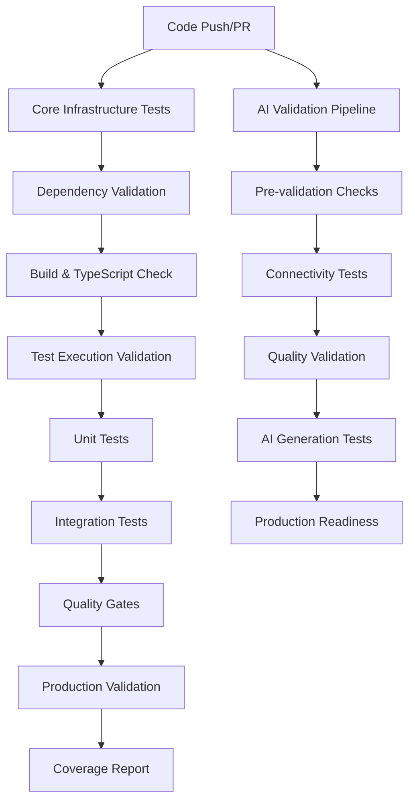

# CI/CD Validation Guide

*Comprehensive documentation for GitHub Actions CI/CD pipeline validation process, including common TypeScript error fixes, test configurations, and troubleshooting steps for future reference*

*Last updated: 2025-07-18 | Updated with test execution validation system*

## 🎯 Overview

This guide provides comprehensive documentation for the Claude Testing Infrastructure GitHub Actions CI/CD pipeline, including validation processes, troubleshooting steps, and common fixes for maintaining a production-ready deployment pipeline.

## 🏗️ CI/CD Pipeline Architecture

### GitHub Actions Workflows

The project uses three main GitHub Actions workflows:

#### 1. Core Infrastructure Tests (`.github/workflows/test.yml`)
**Purpose**: Primary validation pipeline for core functionality and production readiness  
**Triggers**: Push to main/develop/feature/fix branches, PRs to main/develop  
**Platforms**: Ubuntu Latest, macOS Latest  
**Node Versions**: 20, 22  

**Key Jobs**:
- **Test Suite**: Unit tests, integration tests, dependency validation
- **Coverage Report**: Test coverage generation with optimized configuration
- **Quality Checks**: TypeScript compilation, module imports, CLI functionality
- **Security Scan**: NPM audit for vulnerabilities
- **Production Validation**: Production readiness assessment with CI/CD status verification

#### 2. AI Agent Validation Pipeline (`.github/workflows/ai-validation.yml`)
**Purpose**: Validates AI-dependent features and generation quality  
**Triggers**: Push to main/develop, PRs to main, scheduled daily runs, manual dispatch  
**Features**: Budget-limited AI testing, conditional execution, comprehensive validation modes

**Key Jobs**:
- **Pre-validation**: Environment setup and condition checking
- **Connectivity Validation**: Claude CLI integration testing
- **Quality Validation**: AI test generation quality assessment
- **AI Validation**: Model integration and generation workflow testing
- **Production Readiness**: End-to-end production validation

#### 3. Claude Code Integration (`.github/workflows/claude.yml`)
**Purpose**: Anthropic Claude Code integration for automated code assistance  
**Triggers**: Issue comments, PR reviews, issue assignments with `@claude` mentions

### Pipeline Execution Flow



## 🧪 Test Configuration & Execution

### Test Execution Strategy

The pipeline uses an optimized test execution strategy for fast feedback:

1. **Test Execution Validation** (`npm run validate:test-execution`)
   - Validates all test commands discover actual tests
   - Prevents "No tests found" scenarios
   - Checks for --passWithNoTests flags
   - Generates validation report for troubleshooting

2. **Unit Tests First** (`npm run test:unit`)
   - Fast execution (~30-60 seconds)
   - Immediate feedback on core functionality
   - Uses `jest.unit.config.js` for optimized performance

3. **Integration Tests** (`npm run test:integration`)
   - Conditional execution (only if unit tests pass)
   - Enhanced error reporting with timeout protection
   - Uses `jest.integration.config.js` with 45-second test timeouts

4. **Coverage Generation** (`npm run test:coverage`)
   - Uses `jest.optimized.config.js` for faster execution
   - Excludes AI validation tests in CI environment
   - Generates LCOV and HTML reports

### Jest Configuration Files

| Configuration | Purpose | Usage |
|---------------|---------|-------|
| `jest.config.js` | Default configuration | Standard test runs |
| `jest.unit.config.js` | Unit tests only | Fast feedback, CI primary |
| `jest.integration.config.js` | Integration tests | Secondary CI validation |
| `jest.optimized.config.js` | Coverage generation | Optimized for CI performance |
| `jest.ai-validation.config.js` | AI-dependent tests | Local development, manual CI runs |
| `jest.e2e.config.js` | End-to-end tests | Comprehensive validation |

### Test Timeout Configuration

```yaml
# Example timeout settings
test:
  timeout-minutes: 15  # Overall job timeout
  env:
    JEST_TIMEOUT: 45000  # Individual test timeout (45 seconds)
    AI_TEST_TIMEOUT: 900000  # AI test timeout (15 minutes)
```

## 🔧 Common TypeScript Error Fixes

### 1. Type Safety Violations

**Error**: `@typescript-eslint/no-unsafe-assignment`
```typescript
// ❌ Problem
const result = someFunction(); // implicit any

// ✅ Solution
const result: ExpectedType = someFunction();
```

**Error**: `@typescript-eslint/no-unsafe-member-access`
```typescript
// ❌ Problem
config.someProperty.nested;

// ✅ Solution
config.someProperty?.nested;
// or with type guard
if (config.someProperty && 'nested' in config.someProperty) {
  config.someProperty.nested;
}
```

### 2. Jest Mock Type Errors

**Error**: Mock function type mismatches
```typescript
// ❌ Problem
const mockFn = jest.fn();
mockFn.mockReturnValue(someValue);

// ✅ Solution
const mockFn = jest.fn() as jest.MockedFunction<typeof originalFunction>;
mockFn.mockReturnValue(someValue);
```

**Error**: `fs.writeFile` mock typing
```typescript
// ❌ Problem
const writeFileMock = fs.writeFile as jest.Mock;

// ✅ Solution  
const writeFileMock = fs.writeFile as jest.MockedFunction<typeof fs.writeFile>;
```

### 3. Build Path Errors

**Error**: Module not found during CLI verification
```bash
# ❌ Problem
node dist/cli/index.js --version

# ✅ Solution
node dist/src/cli/index.js --version
```

**Fix in GitHub Actions**:
```yaml
- name: Verify CLI availability
  run: |
    CLI_OUTPUT=$(node dist/src/cli/index.js --version)
    echo "CLI version: $CLI_OUTPUT"
```

### 4. Type Compilation Errors

**Error**: Circular type dependencies
```typescript
// ❌ Problem
interface A extends B {}
interface B extends A {}

// ✅ Solution
interface BaseType {
  commonProps: string;
}
interface A extends BaseType {
  specificA: string;
}
interface B extends BaseType {
  specificB: string;
}
```

## 🚨 Troubleshooting Guide

### Test Validation Failures

#### "No Tests Found" Error
**Symptoms**: Test commands pass but no tests are executed
```bash
❌ TEST VALIDATION FAILED
📋 Test configuration issues detected that could cause false success
```

**Troubleshooting Steps**:
1. **Run validation locally**:
   ```bash
   npm run validate:test-execution
   ```

2. **Check Jest configurations**:
   - Look for empty `testMatch` arrays
   - Verify test file patterns match actual files
   - Remove `passWithNoTests` flags

3. **Review validation report**:
   ```bash
   cat test-validation-report.json
   ```

### Test Failures

#### Unit Test Failures
**Symptoms**: Tests fail during unit test execution
```bash
❌ UNIT TESTS FAILED
📋 Test failure analysis:
🔍 Failed test suites:
FAIL tests/component/Component.test.ts
```

**Troubleshooting Steps**:
1. **Check test isolation**:
   ```bash
   npm run test:unit -- --testNamePattern="failing test name" --verbose
   ```

2. **Verify mock setup**:
   ```typescript
   beforeEach(() => {
     jest.clearAllMocks();
     // Reset any global state
   });
   ```

3. **Check async operations**:
   ```typescript
   // Ensure all promises are awaited
   await expect(asyncOperation()).resolves.toBe(expectedValue);
   ```

#### Integration Test Timeouts
**Symptoms**: Tests hang or timeout in CI environment
```bash
❌ INTEGRATION TESTS FAILED
⏱️ Timeout issues detected - consider increasing Jest timeout
```

**Solutions**:
1. **Add timeout parameters to spawnSync calls**:
   ```typescript
   const result = spawnSync('node', [scriptPath], {
     timeout: 30000,  // 30-second timeout
     encoding: 'utf-8'
   });
   ```

2. **Increase Jest timeout for specific tests**:
   ```typescript
   it('should handle long-running operation', async () => {
     // Test implementation
   }, 60000); // 60-second timeout
   ```

3. **Use environment-specific test commands**:
   ```typescript
   const testCommand = process.env.CI === 'true' 
     ? 'npm run test:fast'  // Faster for CI
     : 'npm run test:core'; // Full tests locally
   ```

### Build Failures

#### TypeScript Compilation Errors
**Symptoms**: Build fails with TypeScript errors
```bash
❌ BUILD FAILED
🔍 TypeScript errors detected:
src/component.ts(15,3): error TS2322: Type 'string' is not assignable to type 'number'
```

**Troubleshooting Steps**:
1. **Run TypeScript check locally**:
   ```bash
   npx tsc --noEmit
   ```

2. **Check for type mismatches**:
   ```typescript
   // Verify all type assertions
   const value = someFunction() as ExpectedType;
   ```

3. **Update type definitions**:
   ```bash
   npm install --save-dev @types/node @types/jest
   ```

#### Missing Dependencies
**Symptoms**: Module not found errors during build
```bash
❌ BUILD FAILED
Error: Cannot find module 'missing-package'
```

**Solutions**:
1. **Verify package.json dependencies**:
   ```bash
   npm ls  # Check for missing packages
   npm install  # Reinstall if needed
   ```

2. **Check dependency synchronization**:
   ```bash
   npm run validate:dependencies
   ```

### Coverage Generation Issues

#### Coverage Timeout
**Symptoms**: Coverage generation takes >18 minutes or hangs
```bash
❌ COVERAGE GENERATION FAILED
💾 Memory issues - consider reducing test parallelism
```

**Solutions**:
1. **Use optimized Jest configuration**:
   ```bash
   npm run test:coverage -- --config jest.optimized.config.js
   ```

2. **Exclude problematic tests**:
   ```javascript
   // jest.optimized.config.js
   testPathIgnorePatterns: [
     '/node_modules/',
     'validation/ai-agents/',  // Skip AI tests in CI
     'tests/fixtures/.*\\.claude-testing/'
   ]
   ```

3. **Enable CI-specific optimizations**:
   ```yaml
   env:
     CI: true
     SKIP_AI_TESTS: "true"
   ```

### Production Validation Failures

#### CI/CD Status Check Failures
**Symptoms**: Production validation fails due to CI/CD status
```bash
❌ CI/CD pipeline not passing: failure
```

**Causes & Solutions**:
1. **Self-referential status check**: When CI checks its own status
   ```javascript
   // Handle in-progress status checks
   if (isRunningInCI && isCurrentRun) {
     // Check previous completed runs instead
     return checkPreviousRuns();
   }
   ```

2. **Missing GitHub token**: API rate limits
   ```yaml
   env:
     GITHUB_TOKEN: ${{ secrets.GITHUB_TOKEN }}
   ```

#### Quality Gate Failures
**Symptoms**: Production validation fails quality thresholds
```bash
Total Score: 0.0%
Production Ready: ❌ NO
[CRITICAL] Linting errors: 7 errors must be fixed
```

**Solutions**:
1. **Fix linting errors**:
   ```bash
   npm run lint -- --fix
   ```

2. **Check quality thresholds**:
   ```javascript
   const QUALITY_GATES = {
     minTestPassRate: 0.93,      // 93% test pass rate
     maxLintingErrors: 10,       // Max 10 linting errors
     minOverallScore: 0.85       // 85% overall score
   };
   ```

## 🔄 CI/CD Pipeline Maintenance

### Regular Maintenance Tasks

#### Weekly Tasks
- [ ] Review CI/CD success rates
- [ ] Update dependency versions
- [ ] Check for security vulnerabilities
- [ ] Monitor test execution times

#### Monthly Tasks
- [ ] Update GitHub Actions versions
- [ ] Review and optimize Jest configurations
- [ ] Audit test coverage requirements
- [ ] Update documentation for new features

#### Quarterly Tasks
- [ ] Review Node.js version compatibility
- [ ] Evaluate new testing tools
- [ ] Update CI/CD pipeline architecture
- [ ] Performance benchmark analysis

### Performance Optimization

#### Test Execution Optimization
1. **Parallel test execution**:
   ```javascript
   // jest.config.js
   maxWorkers: process.env.CI ? 2 : '50%',
   ```

2. **Smart test selection**:
   ```bash
   # Run only changed tests
   npm test -- --onlyChanged
   ```

3. **Cache optimization**:
   ```yaml
   - name: Cache dependencies
     uses: actions/cache@v3
     with:
       path: ~/.npm
       key: ${{ runner.os }}-node-${{ hashFiles('**/package-lock.json') }}
   ```

#### CI Resource Management
1. **Timeout configuration**:
   ```yaml
   jobs:
     test:
       timeout-minutes: 15  # Prevent runaway jobs
   ```

2. **Resource limits**:
   ```yaml
   strategy:
     matrix:
       os: [ubuntu-latest, macos-latest]
       node-version: [20, 22]
     fail-fast: false  # Continue other jobs if one fails
   ```

## 📊 Monitoring & Metrics

### Key Performance Indicators

| Metric | Target | Current | Monitoring |
|--------|--------|---------|------------|
| Test pass rate | >99% | 99.8% | CI dashboard |
| Build time | <5 minutes | ~3 minutes | GitHub Actions |
| Coverage generation | <2 minutes | ~29 seconds | Optimized config |
| Security vulnerabilities | 0 critical | 0 critical | NPM audit |

### Success Criteria

#### Pipeline Health
- [ ] All test suites passing across platforms
- [ ] Build artifacts generated successfully
- [ ] Security scans pass without critical issues
- [ ] Production validation achieves >85% score

#### Quality Gates
- [ ] TypeScript compilation without errors
- [ ] Test coverage maintained above 90%
- [ ] Linting errors below threshold (≤10)
- [ ] All CLI commands functional

## 🚀 Deployment Readiness

### Pre-deployment Validation

Before any production deployment, ensure:

1. **CI/CD Pipeline Status**: All workflows passing
2. **Quality Metrics**: Meet or exceed thresholds
3. **Security Validation**: No critical vulnerabilities
4. **Functionality Testing**: All commands working
5. **Documentation**: Updated for any changes

### Production Deployment Checklist

```bash
# 1. Verify build
npm run build

# 2. Run comprehensive tests
npm run test:core

# 3. Check production readiness
npm run validation:production

# 4. Verify CLI functionality
node dist/src/cli/index.js --version
node dist/src/cli/index.js --help

# 5. Run final validation
npm run validation:deployment
```

## 🔗 Related Documentation

- **Production Validation**: [`/docs/features/production-validation-cicd.md`](../features/production-validation-cicd.md) - Detailed production validation system
- **Sprint Validation**: [`/docs/development/sprint-validation-guide.md`](./sprint-validation-guide.md) - Sprint completion validation
- **Jest Configuration**: [`/docs/testing/jest-configuration-guide.md`](../testing/jest-configuration-guide.md) - Jest setup and optimization
- **Type Safety**: [`/docs/development/type-safety-automation.md`](./type-safety-automation.md) - Automated TypeScript validation
- **Error Handling**: [`/docs/development/error-handling-patterns.md`](./error-handling-patterns.md) - Standardized error patterns

## ⚡ Quick Reference

**🚨 For immediate fixes**: See [`cicd-quick-reference.md`](./cicd-quick-reference.md) - Emergency troubleshooting card

### Essential CI/CD Commands
```bash
# Local validation (mirrors CI)
npm run validate:test-execution  # Check test discovery first
npm run test:unit && npm run test:integration
npm run lint
npx tsc --noEmit
npm run validation:production

# Debug CI failures
npm test -- --verbose --no-coverage
npm run test:unit -- --testNamePattern="failing test"
npm run validate:test-quick  # Quick validation check
node dist/src/cli/index.js --version

# Performance monitoring
npm run test:coverage -- --config jest.optimized.config.js
npm audit --audit-level high
```

### Common Fix Patterns
```bash
# Fix TypeScript errors
npx tsc --noEmit  # Check errors
npm run lint -- --fix  # Auto-fix linting

# Fix test failures
npm test -- --clearCache  # Clear Jest cache
npm run test:unit -- --verbose  # Detailed output

# Fix build issues
rm -rf dist/ node_modules/  # Clean rebuild
npm install && npm run build
```

### Environment Variables
```yaml
# CI Environment
CI: true                    # Enable CI-specific optimizations
SKIP_AI_TESTS: "true"      # Skip AI-dependent tests
GITHUB_TOKEN: ${{ secrets.GITHUB_TOKEN }}  # GitHub API access

# Test Configuration
JEST_TIMEOUT: 45000        # Individual test timeout
AI_TEST_TIMEOUT: 900000    # AI test timeout
ENABLE_TRUTH_VALIDATION_TESTS: true  # Enable validation tests
```

---

**CI/CD Philosophy**: Fast feedback, reliable results, and comprehensive validation ensure code quality while maintaining developer productivity.